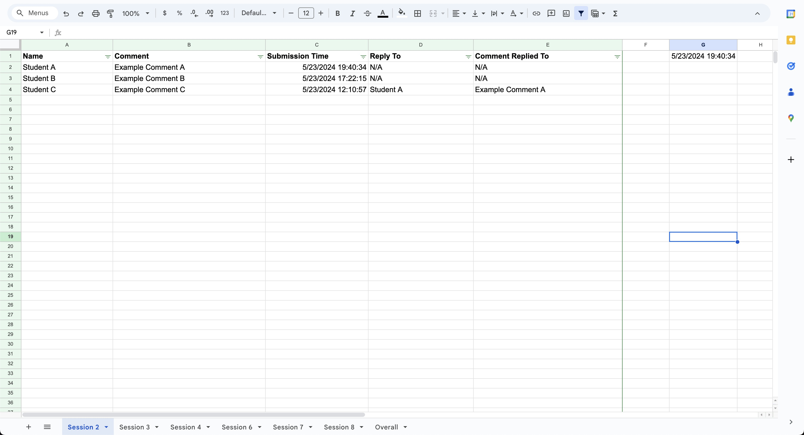

# 📊 Canvas Discussion Data Pull to Google Sheets Script

## Overview

This repository contains a Google Apps Script that automates the process of pulling discussion data from Canvas LMS and populating a Google Sheet with the data. The script can be set to run at regular intervals, ensuring that the Google Sheet is always up-to-date with the latest discussion posts. The script also keeps track of the last check time and only adds new replies to the Google Sheet.

This script was developed for [Professor Timothy J. Goodspeed](https://www.sipa.columbia.edu/communities-connections/faculty/timothy-j-goodspeed) at Columbia's School of International Public Affairs. By having the discussion data in a Google Sheet, Prof. Goodspeed can easily analyze the data, generate reports, and provide feedback in a more accessible format. It also allows him to grade students based on their participation in the discussion forums in an automated format that Canvas does not currently provide.

## ✨ Features

- 📥 Automatically pulls discussion data from Canvas LMS
- 📊 Populates Google Sheets with discussion data, including author names, comments, timestamps, and parent comments
- 🕒 Keeps track of the last check time and only adds new replies
- 📅 Formats timestamps in a readable format
- 📈 Counts the number of replies for each student in each session and updates a summary sheet

## 📸 Screenshots

### Discussion Data in Google Sheets


### Summary Sheet


## 🛠️ Installation

1. Open Google Sheets and create a new spreadsheet.
2. Go to `Extensions` > `Apps Script` to open the Apps Script editor.
3. Copy the script from this repository and paste it into the Apps Script editor.
4. Set up your Canvas API token:
   - Go to `File` > `Project Properties` > `Script Properties`
   - Add a new property named `CANVAS_API_TOKEN` and set its value to your Canvas API token.
5. Save the script.

## 🚀 Usage

1. **Set Up Triggers**: To run the script at regular intervals, create a time-driven trigger:
   ```javascript
   function createTrigger() {
     ScriptApp.newTrigger('main')
       .timeBased()
       .everyMinutes(5)
       .create();
   }
    ```

2. **Create Trigger**: Run the `createTrigger` function to set up the trigger.

3. **Run the Script**: You can manually run the `main` function from the Apps Script editor to fetch data immediately.

## 📋 Google Sheets Configuration
- This script is formatted specifically to the struture of the Google Sheets. In this particular case, there is a discussion forum for 6 particular sessions on CourseWorks (Canvas LMS), and there is a tab/sheet for each session.
- There is also a sheet/tab named `Overall` with student names in column A. This sheet will track the total number of replies for each student in each session, which will help Prof. Goodspeed in grading the students based on their participation/engagement  in the discussion forums.
- Overall, this implementation includes 7 sheets/tabs titled: `Session 2`, `Session 3`, `Session 4`, `Session 6`, `Session 7`, `Session 8`, and `Overall`.

## 🙏 Special Credits
This project was inspired by the work done by [UBC Canvas Discussion](https://github.com/ubc/canvas-discussion). Their approach provided the initial inspiration for the solution to pulling data from Canvas.

## 📄 License
This project is licensed under the MIT License - see the LICENSE file for details.

## 🤝 Contributing
Contributions are welcome! Please feel free to submit a Pull Request.

## 📬 Contact
If you have any questions or suggestions, feel free to reach out to me at [ahmed.m@columbia.edu].
